<!doctype html>

Introduction to task
--------------------

Following report discusess the findings of qunatitative analysis that
was conducted on printing samples of Doglus Color Card. It also outlines
the walkthrough of process that was followed for the said excercise.

### Dataset and Quality Assesment Criteria

The dataset contains measurments of color cards that were taken from a
random batch of production. Thirteen printed sheets were sampled for
examining printing quality. Similarity in color measurments was
considered to be the quality criteria for color printing. Colors were
measured on CIELAB colorspace, the industry standard metric for defining
colors in printing. Each of the colorsheet had 42 color cards/targetsm,
that were arranged in 7 rows and 6 columns. Furthermore, each color card
had 64 color spots with different color print.

#### Delta E (ΔE)

The measure of change in visual perception of two given colors can be
determined by qunatitative means. Delta E76 could be one possilbe tool
for doing such calculation. Quantifying visual perception difference can
help us infer the degree of similarity or dissimilarity of color prints.

Note: For the course of discussion, hereafter, we would assume that
master card is the reference/intended card for printing.

#### Color-Difference Perception table

On a typical scale, the Delta E value ranges from 0 to 100. Following
table shows the delta E and its perception by human eye;

| Delta E   | Color-Difference Perception           |
|-----------|---------------------------------------|
| &lt;= 1.0 | Not perceptible by human eyes.        |
| 1 - 2     | Perceptible through close observation |
| 2 - 10    | Perceptible at a glance               |
| 11 - 49   | Colors are more similar than opposite |
| 100       | Colors are exact opposite             |

Source:
<a href="http://zschuessler.github.io/DeltaE/learn/" class="uri">http://zschuessler.github.io/DeltaE/learn/</a>

Walkthrough of process and possible questions
---------------------------------------------

The steps that were used for the anlysis are as follow:

-   Color measurements for master card and measurment cards were in two
    different formats. Data transformation techniques were applied to
    reformat data in same format
-   Color measurements were aggregated over sheets, cards and colorspots
    by using group by operator, and taking average of color measure
-   Color variation was examined for colorspot in indivisual color
    channels and for colorspot as whole
-   Visual perception difference of measurement cards and master cards
    by using delta E76
-   Effect of indivisual channel on color variation was examined
-   And finally, intresting insights were recorded and presented using
    different graphs and other visual aids

Findings
--------

### 1. Color Dispersion

#### a. Channel Similarity of Master vs Measurements

-   There is no striking disimlarity found in any channel when compared
    to master card
-   Colorspot no. 19 at channel L shows noticable variation

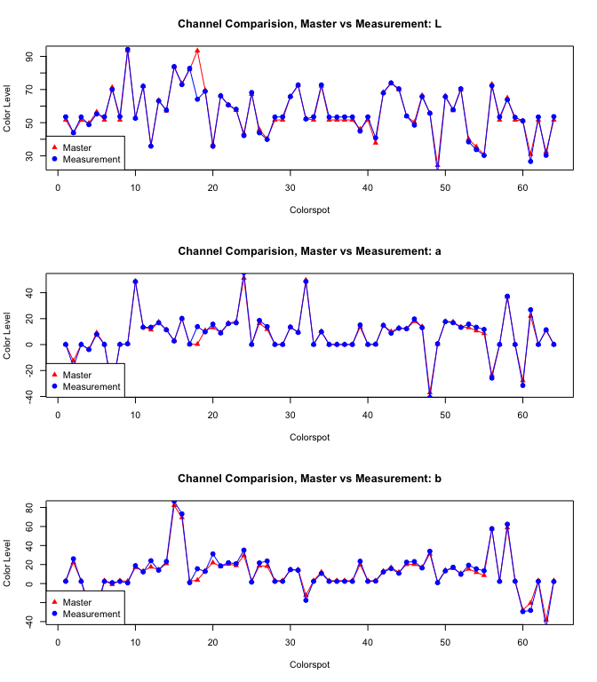

#### b. Measurements behaviour relative to Master in Lab Colorpace

-   All the values of L,a and b going far from 0,0,0 on 3d lab space.
-   Luminance changes barely (L)
-   green-red Values which is far from 0 getting more far but not those
    which are close to 0(a)
-   blue/yellow getting more darker(b)

<section data-separator="^\n\n\n" data-separator-vertical="^\n\n">

</section>

<section data-separator="^\n\n\n" data-separator-vertical="^\n\n">

</section>

-   Color Dispersion On 3d Lab Color space on Master (L,a,b) values
-   Bigger the circle higher the dispersion

<section data-separator="^\n\n\n" data-separator-vertical="^\n\n">

</section>

#### c. Coorelation: Master vs Measurements

-   Visible coorelation between color channels of master cards and
    measurements

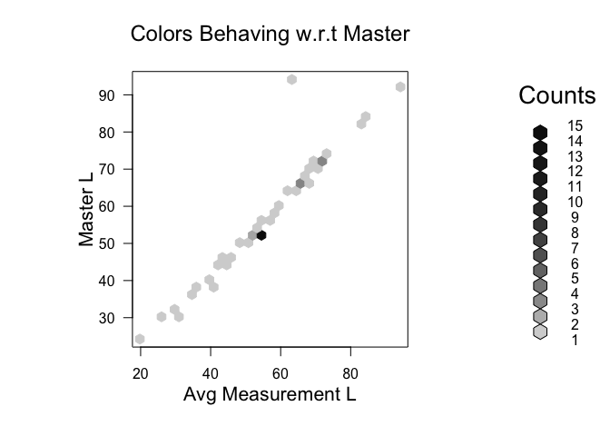

#### d. Color Dispersion over sheet

-   Color Dispersion By Sheet Row
    -   Color difference of cards from all rows are perceptible through
        close observation since Delta E value lies within range of 1 - 2
        (as indicated by perception table)
    -   Row 7 has least visible difference perception due to low delta E
    -   Row 1 has highest difference perception

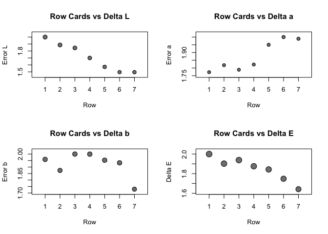

-   Color Dispersion By Sheet Column
    -   Column 6 has least degree of visible difference perception
    -   Column 3 has highest degree of visible difference perception

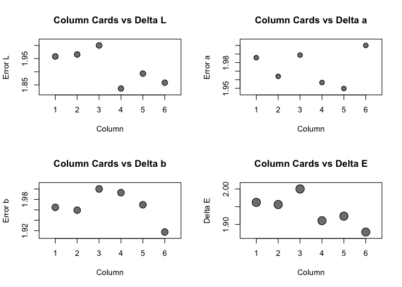

#### e. Color Dispersion w.r.t indivisual channels

-   Color Dispersion behaviour On Individual L,a,b Scale shows varying
    error
-   1.  scale b contributes to most error differences are on 30-40

-   1.  scale a and b contributes to most error differences are on 0-10

-   1.  scale a and b contributes to most error differences are on 0-20

#### f. Similarity within average card (amongst colorpsots)

-   colorspot 3x2 is least similar (delta E)
-   colorspot in delta b has most differences as compared to other two
    dimensions

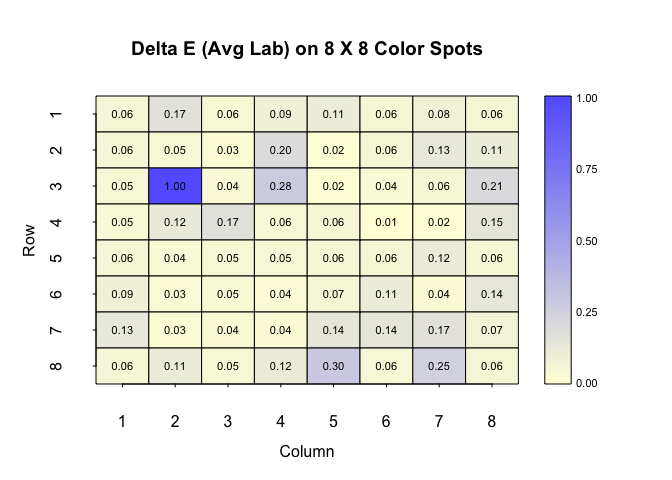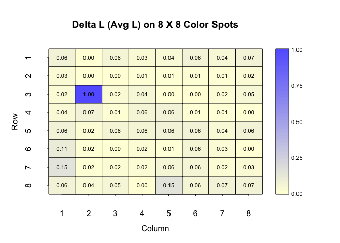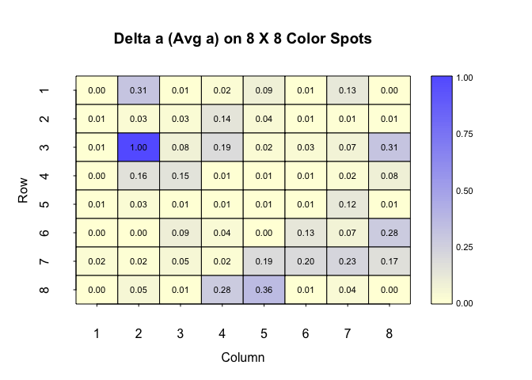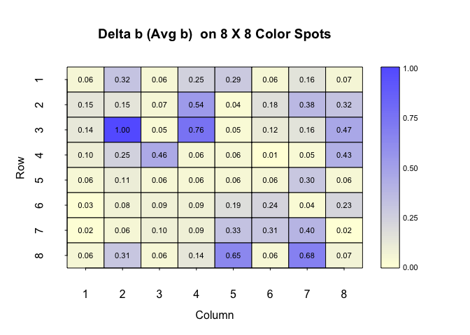

### 2. Influence of channels on Delta E

#### a. Correlation between Delta E and Channels

-   There exists a correlation between Delta E and channel L from
    measurement cards, although it is not too strong
-   No correlation whatsoever for other two channels

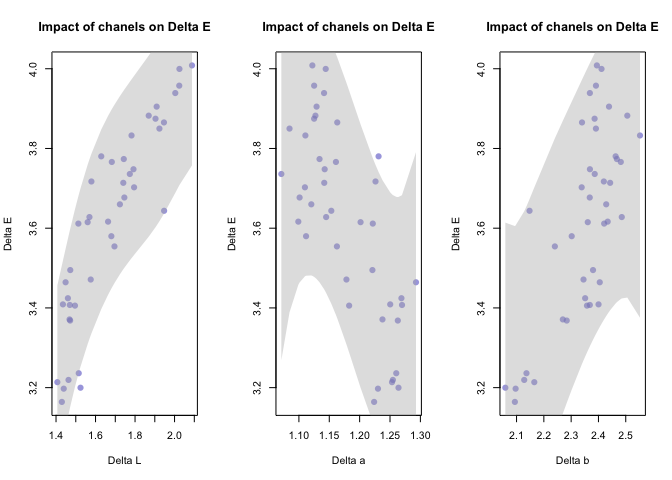

#### b. Impact of Delta E vs Delta L/a/b

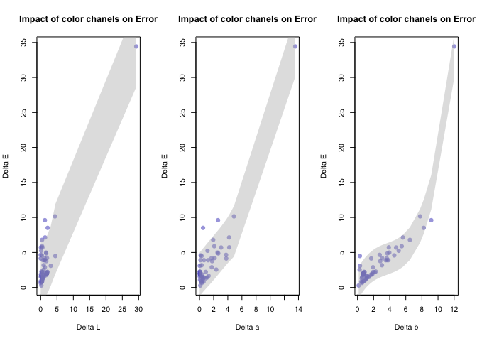

### 3. General Obervations

#### Distribution Comparision of Master vs Avg. Measurements

-   Distributuon of all channels from measurements are very similar to
    master
-   All cards seem to follow a normal distribution
-   Channel b and c seem to have a bi-modal distribution

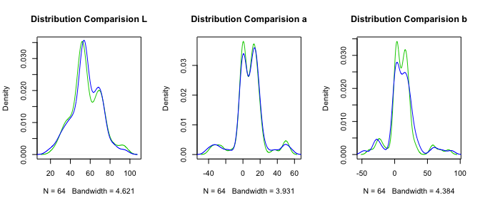
